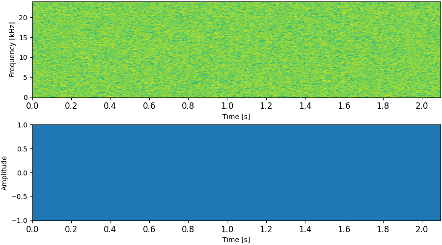
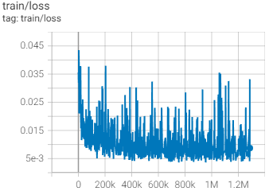
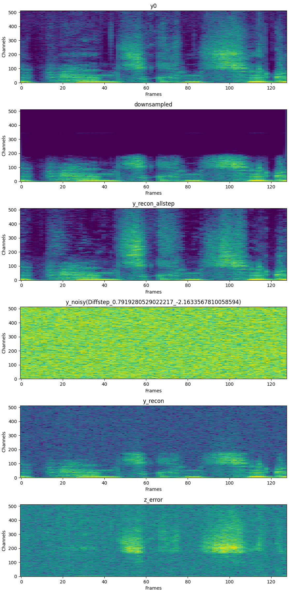

# NU-Wave2 &mdash; Official PyTorch Implementation

**NU-Wave 2: A General Neural Audio Upsampling Model for Various Sampling Rates**<br>
Seungu Han, Junhyeok Lee @ [MINDsLab Inc.](https://github.com/mindslab-ai), SNU

[](https://arxiv.org/abs/2206.08545) [](https://github.com/mindslab-ai/nuwave2) [](https://mindslab-ai.github.io/nuwave2/)

Official Pytorch+[Lightning](https://github.com/PyTorchLightning/pytorch-lightning) Implementation for NU-Wave 2.



## Requirements
- [Pytorch](https://pytorch.org/) >=1.7.0 for nn.SiLU(swish activation)
- [Pytorch-Lightning](https://github.com/PyTorchLightning/pytorch-lightning)==1.2.10
- The requirements are highlighted in [requirements.txt](./requirements.txt).
- We also provide docker setup [Dockerfile](./Dockerfile).

## Clone our Repository
```bash
git clone --recursive https://github.com/mindslab-ai/nuwave2.git
cd nuwave2
```

## Preprocessing
Before running our project, you need to download and preprocess dataset to `.wav` files
1. Download [VCTK dataset](https://datashare.ed.ac.uk/handle/10283/3443)
2. Remove speaker `p280` and `p315`
3. Modify path of downloaded dataset `data:base_dir` in `hparameter.yaml`
4. run `utils/flac2wav.py`
```shell script
python utils/flac2wav.py
```

## Training
1. Adjust `hparameter.yaml`, especially `train` section.
```yaml
train:
  batch_size: 12 # Dependent on GPU memory size
  lr: 2e-4
  weight_decay: 0.00
  num_workers: 8 # Dependent on CPU cores
  gpus: 2 # number of GPUs
  opt_eps: 1e-9
  beta1: 0.9
  beta2: 0.99
```
- Adjust `data` section in `hparameters.yaml`.
```yaml
data:
  timestamp_path: 'vctk-silence-labels/vctk-silences.0.92.txt'
  base_dir: '/DATA1/VCTK-0.92/wav48_silence_trimmed/'
  dir: '/DATA1/VCTK-0.92/wav48_silence_trimmed_wav/' #dir/spk/format
  format: '*mic1.wav'
  cv_ratio: (100./108., 8./108., 0.00) #train/val/test
```
2. run `trainer.py`.
```shell script
$ python trainer.py
```
- If you want to resume training from checkpoint, check parser.
```python
    parser = argparse.ArgumentParser()
    parser.add_argument('-r', '--resume_from', type =int,\
            required = False, help = "Resume Checkpoint epoch number")
    parser.add_argument('-s', '--restart', action = "store_true",\
            required = False, help = "Significant change occured, use this")
    parser.add_argument('-e', '--ema', action = "store_true",\
            required = False, help = "Start from ema checkpoint")
    args = parser.parse_args()
```
- During training, tensorboard logger is logging loss, spectrogram and audio.
```shell script
$ tensorboard --logdir=./tensorboard --bind_all
```




## Evaluation
run `for_test.py`
```shell script
python for_test.py -r {checkpoint_number} {-e:option, if ema} {--save:option}
```
Please check parser.
```python
    parser = argparse.ArgumentParser()
    parser.add_argument('-r', '--resume_from', type =int,
                required = True, help = "Resume Checkpoint epoch number")
    parser.add_argument('-e', '--ema', action = "store_true",
                required = False, help = "Start from ema checkpoint")
    parser.add_argument('--save', action = "store_true",
               required = False, help = "Save file")
    parser.add_argument('--sr', type=int, \
               required=True, help="input sampling rate")
```

## Inference
- run `inference.py`
```shell script
python inference.py -c {checkpoint_path} -i {input audio} --sr {Sampling rate of input audio} {--steps:option} {--gt:option}
```
Please check parser.
```python
    parser = argparse.ArgumentParser()
    parser.add_argument('-c',
                        '--checkpoint',
                        type=str,
                        required=True,
                        help="Checkpoint path")
    parser.add_argument('-i',
                        '--wav',
                        type=str,
                        default=None,
                        help="audio")
    parser.add_argument('--sr',
                        type=int,
                        required=True,
                        help="Sampling rate of input audio")
    parser.add_argument('--steps',
                        type=int,
                        required=False,
                        help="Steps for sampling")
    parser.add_argument('--gt', action="store_true",
                        required=False, help="Whether the input audio is 48 kHz ground truth audio.")
    parser.add_argument('--device',
                        type=str,
                        default='cuda',
                        required=False,
                        help="Device, 'cuda' or 'cpu'")
```

## References
This implementation uses code from following repositories:
- [official NU-Wave pytorch implementation](https://github.com/mindslab-ai/nuwave)
- [revsic's Jax/Flax implementation of Variational-DiffWave](https://github.com/revsic/jax-variational-diffwave)
- [ivanvovk's WaveGrad pytorch implementation](https://github.com/ivanvovk/WaveGrad)
- [lmnt-com's DiffWave pytorch implementation](https://github.com/lmnt-com/diffwave)
- [NVlabs' SPADE pytorch implementation](https://github.com/NVlabs/SPADE)
- [pkumivision's FFC pytorch implementation](https://github.com/pkumivision/FFC)

This README and the webpage for the audio samples are inspired by:
- [Tips for Publishing Research Code](https://github.com/paperswithcode/releasing-research-code)
- [Audio samples webpage of DCA](https://google.github.io/tacotron/publications/location_relative_attention/)
- [Cotatron](https://github.com/mindslab-ai/cotatron/)
- [Audio samples wabpage of WaveGrad](https://wavegrad.github.io)

The audio samples on our [webpage](https://mindslab-ai.github.io/nuwave2/) are partially derived from:
- [VCTK dataset(0.92)](https://datashare.ed.ac.uk/handle/10283/3443): 46 hours of English speech from 108 speakers.
- [LJSpeech](https://keithito.com/LJ-Speech-Dataset/): a single-speaker English dataset consists of 13100 short audio clips of a female speaker reading passages from 7 non-fiction books, approximately 24 hours in total.

## Repository Structure
```
.
|-- Dockerfile
|-- LICENSE
|-- README.md
|-- dataloader.py           # Dataloader for train/val(=test)
|-- diffusion.py            # DPM
|-- for_test.py             # Test with for_loop.
|-- hparameter.yaml         # Config
|-- inference.py            # Inference
|-- lightning_model.py      # NU-Wave 2 implementation.
|-- model.py                # NU-Wave 2 model based on lmnt-com's DiffWave implementation
|-- requirements.txt        # requirement libraries
|-- trainer.py              # Lightning trainer
|-- utils
|   |-- flac2wav.py             # Preprocessing
|   |-- stft.py                 # STFT layer
|   `-- tblogger.py             # Tensorboard Logger for lightning
|-- docs                    # For github.io
|   |-- ...
`-- vctk-silence-labels     # For trimming
    |-- ...
```

## Citation & Contact
If this repository useful for your research, please consider citing!
```bib
@article{han2022nu,
  title={NU-Wave 2: A General Neural Audio Upsampling Model for Various Sampling Rates},
  author={Han, Seungu and Lee, Junhyeok},
  journal={arXiv preprint arXiv:2206.08545},
  year={2022}
}
```
If you have a question or any kind of inquiries, please contact Seungu Han at [hansw032@snu.ac.kr](mailto:hansw0326@snu.ac.kr)
